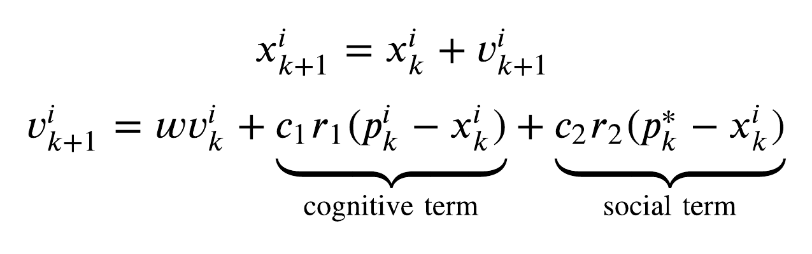
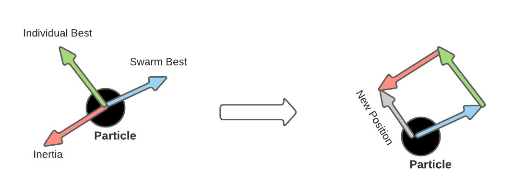
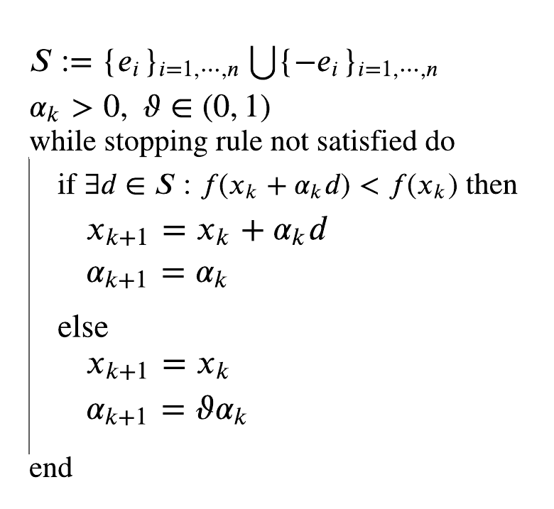
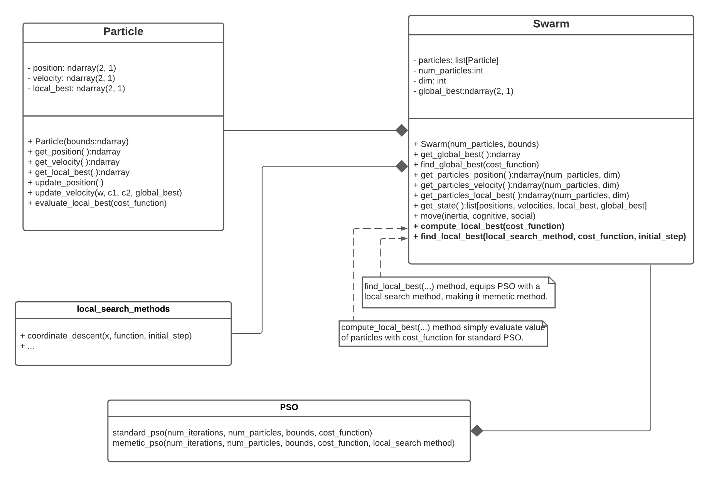
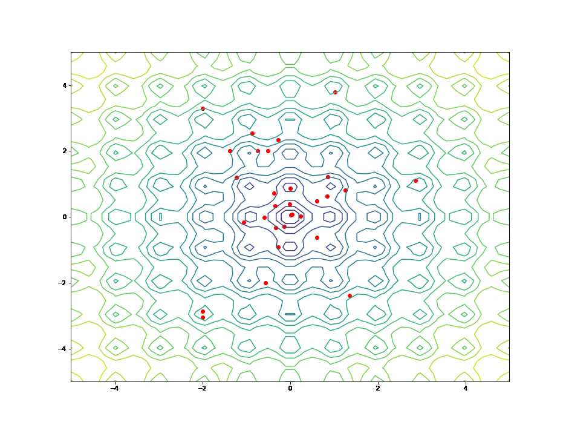

# Particle Swarm Optimization (PSO)
Pengembangan algoritma heuristik varian standar dan memetika untuk optimasi global.

## Introduction
Particle swarm Optimization (PSO) telah berhasil diterapkan di banyak bidang penelitian dan aplikasi. Hal ini menunjukkan bahwa PSO dapat memberikan hasil yang lebih baik dengan cara yang lebih cepat dan lebih murah dibandingkan dengan metode lain. Bisa juga diparalelkan. Selain itu, tidak menggunakan gradien masalah, dengan kata lain, PSO tidak memerlukan masalah untuk didiferensiasikan. PSO adalah rutinitas pengoptimalan yang terinspirasi secara biologis yang dirancang untuk meniru kawanan burung atau kawanan ikan.

Tujuan dari proyek ini adalah standar pengembang dan memetic PSO di python dan notebook jupyter. Direktori tata letak mengikuti,

├── docker-compose.yaml # tidak termasuk
├── Dockerfile # tidak termasuk
├── termasuk # Proyek utama
│   ├── cost_function.py
│   ├── __init__.py
│   ├── local_search_methods.py
│   ├── particle.py
│   └── swarm.py
├── README.md
├── setup.py
└── src         # utility (.png and test function)
    ├── main.py
    ├── PSO.ipynb  # complete report and code
    ├── ...
```    
Untuk menggunakan proyek ini, cukup klon repo dan folder include menyediakan modul yang diperlukan ke PSO.ipynb dengan laporan dan kode lengkap. Jika Anda ingin menjalankan _PSO.ipynb_ dalam mode lokal, Anda harus mengatur sel awal dengan ,
```python
import sys
sys.path.append('your_cloned_directory/include')
```

## PSO Theory
Untuk setiap iterasi gerombolan bergerak sesuai dengan dua persamaan berikut,

<p align=center>
  
</p>

Konsep utama di balik PSO [PSO](https://en.wikipedia.org/wiki/Particle_swarm_optimization) adalah bahwa ada keseimbangan konstan antara tiga gaya berbeda yang menarik setiap partikel,
	- gaya inersia yang mendorong ke arah kecepatan sebelumnya
	- kekuatan kognitif yang mendorong ke arah posisi terbaik yang diketahui partikel individu
	- kekuatan sosial yang mendorong ke arah posisi swarm yang paling terkenal
Ketiga gaya ini kemudian ditimbang olehw, c1, c2 dan diganggu secara acak oleh r1 dan r2.


<p align=center>
  
</p>

## Coordinate Descent for Memetic Variant
Dalam ilmu komputer dan riset operasi, algoritma memetic (MA) adalah perpanjangan dari algoritma genetika tradisional. Ini menggunakan teknik pencarian lokal untuk mengurangi kemungkinan prematur

Metode ini menghasilkan populasi awal yang lebih baik dan mengevaluasi posisi partikel untuk setiap iterasi.e konvergensi. Dalam hal ini, kami telah melengkapi algoritma PSO dengan metode pencarian lokal untuk menghasilkan individu terbaik lokal untuk setiap partikel.

Untuk tujuan penelitian ini, [keturunan koordinat](https://en.wikipedia.org/wiki/Coordinate_descent) algoritma telah dipilih. Ini diimplementasikan dalam modul yang dapat diperluas <i>local_search_method</i>. Kode semu berikut,

<p align=center>
  
</p>

## Implementation
<p align=center>
  
</p>

## Results
Pengujian dilakukan pada [Fungsi Ackley](https://en.wikipedia.org/wiki/Ackley_function) dan kami mendapatkan hasil berikut,
<p align=center>
   
</p>
standar-PSO dan memetik-PSO masing-masing.

## Developing
Untuk mengembangkan proyek ini, saya menggunakan layanan buruh pelabuhan,
```
FROM nvidia/cuda:10.2-cudnn7-devel-ubuntu18.04 as base
ENV PYTHONPATH "${PYTHONPATH}:/src:/include:/plots"
RUN apt-get update && apt-get install -y nano
RUN apt install -y python3-pip && pip3 install numpy
RUN pip3 install jupyter && pip3 install matplotlib
RUN pip3 install imageio
```
dengan komposisi buruh pelabuhan,
```
version: '3.7'

services:
  pyGo:
    container_name: 'pyGo'
    build:
      context: .
      dockerfile: ./Dockerfile
    image: base
    volumes:
      - ./src:/src
      - ./plots:/plots
      - ./include:/include

  notebookGo:
    container_name: 'notebookGo'
    build:
      context: .
      dockerfile: ./Dockerfile
    image: base
    volumes:
      - ./src:/src
      - ./plots:/plots
      - ./include:/include
    command: jupyter notebook --port=8888 --no-browser --ip=0.0.0.0 --allow-root
    ports:
      - 8888:8888
    network_mode: 'host'
```
